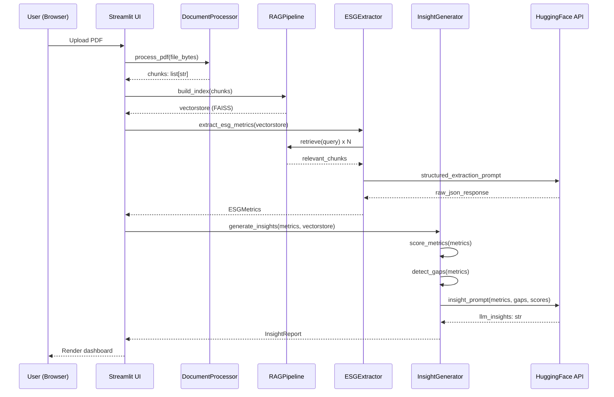

# Design Document: AI-Driven BRSR / ESG Report Analyzer

## Overview

A Streamlit application that accepts ESG/BRSR PDF reports, runs a lightweight RAG pipeline to extract structured ESG metrics, and generates intelligent, context-aware insights using a free Hugging Face inference model. The system combines rule-based scoring, heuristic gap detection, and LLM reasoning to produce outputs that feel like a real analyst's review rather than a simple extraction.

## Main Algorithm / Workflow



## Core Interfaces / Types

```python
from dataclasses import dataclass, field
from typing import Optional

@dataclass
class ESGMetrics:
    # Environmental
    ghg_scope1: Optional[float] = None          # tCO2e
    ghg_scope2: Optional[float] = None          # tCO2e
    energy_consumption: Optional[float] = None  # GJ
    renewable_energy_pct: Optional[float] = None # 0-100
    water_withdrawal: Optional[float] = None    # KL
    waste_generated: Optional[float] = None     # MT
    waste_recycled_pct: Optional[float] = None  # 0-100

    # Social
    total_employees: Optional[int] = None
    women_employees_pct: Optional[float] = None # 0-100
    training_hours_avg: Optional[float] = None
    lost_time_injury_rate: Optional[float] = None
    csr_spend: Optional[float] = None           # INR crore

    # Governance
    board_size: Optional[int] = None
    independent_directors_pct: Optional[float] = None # 0-100
    women_directors_pct: Optional[float] = None       # 0-100
    audit_committee_independent: Optional[bool] = None
    whistleblower_policy: Optional[bool] = None

    # Meta
    company_name: Optional[str] = None
    reporting_year: Optional[str] = None
    framework: Optional[str] = None  # "BRSR", "GRI", "TCFD", etc.
    raw_text_sample: str = ""

@dataclass
class ESGScore:
    environmental: float  # 0-100
    social: float         # 0-100
    governance: float     # 0-100
    overall: float        # weighted average
    grade: str            # A/B/C/D

@dataclass
class Gap:
    category: str         # "Environmental" | "Social" | "Governance"
    field: str            # metric name
    severity: str         # "critical" | "moderate" | "minor"
    message: str

@dataclass
class InsightReport:
    score: ESGScore
    gaps: list[Gap]
    llm_insights: str     # free-text LLM narrative
    highlights: list[str] # top 3-5 positive signals
    red_flags: list[str]  # top 3-5 concerns
    recommendations: list[str]
```

## Key Functions with Formal Specifications

### `process_pdf(file_bytes: bytes) -> list[str]`

```python
def process_pdf(file_bytes: bytes, chunk_size: int = 500, overlap: int = 50) -> list[str]:
    ...
```

**Preconditions:**
- `file_bytes` is a valid PDF binary (non-empty)
- `chunk_size > overlap >= 0`

**Postconditions:**
- Returns a non-empty list of text strings
- Each chunk is at most `chunk_size` tokens
- Adjacent chunks share `overlap` tokens for context continuity
- Raises `ValueError` if PDF is unreadable or yields no text

**Loop Invariant:** For each page processed, all prior pages have been appended to the text buffer.

---

### `build_index(chunks: list[str]) -> FAISS`

```python
def build_index(chunks: list[str]) -> FAISS:
    ...
```

**Preconditions:**
- `chunks` is non-empty
- Each chunk is a non-empty string

**Postconditions:**
- Returns a FAISS vectorstore with `len(chunks)` indexed documents
- Embeddings generated via `sentence-transformers/all-MiniLM-L6-v2`
- Index is queryable via `.similarity_search(query, k)`

---

### `retrieve(vectorstore: FAISS, query: str, k: int = 4) -> list[str]`

```python
def retrieve(vectorstore: FAISS, query: str, k: int = 4) -> list[str]:
    ...
```

**Preconditions:**
- `vectorstore` is a built FAISS index
- `query` is a non-empty string
- `1 <= k <= len(indexed_docs)`

**Postconditions:**
- Returns exactly `min(k, total_docs)` most semantically similar chunks
- Results are ordered by descending similarity score

---

### `extract_esg_metrics(vectorstore: FAISS, llm_client) -> ESGMetrics`

```python
def extract_esg_metrics(vectorstore: FAISS, llm_client) -> ESGMetrics:
    ...
```

**Preconditions:**
- `vectorstore` is a valid built index
- `llm_client` is an initialized HuggingFace InferenceClient

**Postconditions:**
- Returns an `ESGMetrics` instance; fields are `None` when not found in document
- At minimum, `company_name` or `reporting_year` is populated if present
- Never raises on missing fields — uses `None` as sentinel

**Algorithm:**

```python
EXTRACTION_QUERIES = {
    "ghg": "GHG emissions scope 1 scope 2 carbon dioxide CO2 tonnes",
    "energy": "energy consumption renewable electricity gigajoules",
    "water": "water withdrawal consumption kilolitres",
    "waste": "waste generated recycled hazardous non-hazardous",
    "employees": "total employees headcount workforce gender women",
    "training": "training hours learning development",
    "safety": "lost time injury LTIFR accidents fatalities",
    "board": "board of directors independent directors women board",
    "policies": "whistleblower policy audit committee ESG governance",
    "csr": "CSR spend corporate social responsibility expenditure",
}

def extract_esg_metrics(vectorstore, llm_client):
    context_parts = []
    for key, query in EXTRACTION_QUERIES.items():
        chunks = retrieve(vectorstore, query, k=3)
        context_parts.append(f"[{key.upper()}]\n" + "\n".join(chunks))

    context = "\n\n".join(context_parts)
    prompt = build_extraction_prompt(context)
    raw = llm_client.text_generation(prompt, max_new_tokens=800)
    return parse_metrics_from_llm_output(raw)
```

---

### `score_metrics(metrics: ESGMetrics) -> ESGScore`

```python
def score_metrics(metrics: ESGMetrics) -> ESGScore:
    ...
```

**Preconditions:**
- `metrics` is a valid `ESGMetrics` instance

**Postconditions:**
- Returns `ESGScore` with all fields populated
- `0.0 <= environmental, social, governance, overall <= 100.0`
- `grade` ∈ {"A", "B", "C", "D"}
- Score degrades proportionally with `None` fields (missing data penalised)

**Algorithm:**

```python
def score_metrics(metrics: ESGMetrics) -> ESGScore:
    # Each pillar scored 0-100 based on presence + quality of data
    # Presence: each non-None field contributes base points
    # Quality: values within industry benchmarks add bonus points

    E_FIELDS = ["ghg_scope1", "ghg_scope2", "energy_consumption",
                "renewable_energy_pct", "water_withdrawal",
                "waste_generated", "waste_recycled_pct"]

    S_FIELDS = ["total_employees", "women_employees_pct",
                "training_hours_avg", "lost_time_injury_rate", "csr_spend"]

    G_FIELDS = ["board_size", "independent_directors_pct",
                "women_directors_pct", "audit_committee_independent",
                "whistleblower_policy"]

    def pillar_score(fields, obj):
        present = sum(1 for f in fields if getattr(obj, f) is not None)
        base = (present / len(fields)) * 70  # 70 pts for disclosure
        bonus = compute_quality_bonus(fields, obj)  # up to 30 pts
        return min(base + bonus, 100.0)

    e = pillar_score(E_FIELDS, metrics)
    s = pillar_score(S_FIELDS, metrics)
    g = pillar_score(G_FIELDS, metrics)
    overall = 0.4 * e + 0.35 * s + 0.25 * g

    grade = "A" if overall >= 75 else "B" if overall >= 55 else "C" if overall >= 35 else "D"
    return ESGScore(environmental=e, social=s, governance=g, overall=overall, grade=grade)
```

**Loop Invariant:** For each field evaluated, the running score is non-negative and bounded by the maximum achievable for fields processed so far.

---

### `detect_gaps(metrics: ESGMetrics) -> list[Gap]`

```python
def detect_gaps(metrics: ESGMetrics) -> list[Gap]:
    ...
```

**Preconditions:**
- `metrics` is a valid `ESGMetrics` instance

**Postconditions:**
- Returns a list (possibly empty) of `Gap` objects
- Each gap has `severity` ∈ {"critical", "moderate", "minor"}
- Critical gaps are listed before moderate, moderate before minor

**Algorithm:**

```python
CRITICAL_FIELDS = {
    "ghg_scope1": ("Environmental", "Scope 1 GHG emissions not disclosed — mandatory under BRSR"),
    "ghg_scope2": ("Environmental", "Scope 2 GHG emissions not disclosed — mandatory under BRSR"),
    "total_employees": ("Social", "Total employee count missing — core BRSR indicator"),
    "independent_directors_pct": ("Governance", "Board independence ratio not reported"),
}

MODERATE_FIELDS = {
    "renewable_energy_pct": ("Environmental", "Renewable energy share not disclosed"),
    "women_employees_pct": ("Social", "Gender diversity data absent"),
    "lost_time_injury_rate": ("Social", "Safety performance metrics missing"),
    "whistleblower_policy": ("Governance", "Whistleblower policy status not mentioned"),
}

def detect_gaps(metrics):
    gaps = []
    for field, (cat, msg) in CRITICAL_FIELDS.items():
        if getattr(metrics, field) is None:
            gaps.append(Gap(cat, field, "critical", msg))
    for field, (cat, msg) in MODERATE_FIELDS.items():
        if getattr(metrics, field) is None:
            gaps.append(Gap(cat, field, "moderate", msg))
    # Minor: quality checks on present values
    if metrics.renewable_energy_pct is not None and metrics.renewable_energy_pct < 5:
        gaps.append(Gap("Environmental", "renewable_energy_pct", "minor",
                        f"Renewable energy at {metrics.renewable_energy_pct:.1f}% — well below industry average"))
    if metrics.women_directors_pct is not None and metrics.women_directors_pct < 15:
        gaps.append(Gap("Governance", "women_directors_pct", "minor",
                        "Women on board below SEBI recommended threshold of 15%"))
    return gaps
```

---

### `generate_insights(metrics: ESGMetrics, vectorstore: FAISS, llm_client) -> InsightReport`

```python
def generate_insights(metrics: ESGMetrics, vectorstore: FAISS, llm_client) -> InsightReport:
    ...
```

**Preconditions:**
- `metrics` is populated (at least partially)
- `vectorstore` is a valid FAISS index
- `llm_client` is initialized

**Postconditions:**
- Returns a fully populated `InsightReport`
- `llm_insights` is a non-empty string
- `highlights` and `red_flags` each contain 1–5 items
- `recommendations` contains 1–5 actionable items

**Algorithm:**

```python
def generate_insights(metrics, vectorstore, llm_client):
    score = score_metrics(metrics)
    gaps = detect_gaps(metrics)

    # Retrieve narrative context for LLM
    narrative_chunks = retrieve(vectorstore, "ESG strategy targets commitments future plans", k=4)
    narrative_context = "\n".join(narrative_chunks)

    # Build structured prompt
    prompt = build_insight_prompt(metrics, score, gaps, narrative_context)
    llm_response = llm_client.text_generation(prompt, max_new_tokens=600, temperature=0.4)

    # Parse structured sections from LLM output
    highlights, red_flags, recommendations = parse_insight_sections(llm_response)

    # Fallback: rule-based highlights/red_flags if LLM parsing fails
    if not highlights:
        highlights = derive_highlights_heuristic(metrics, score)
    if not red_flags:
        red_flags = [g.message for g in gaps if g.severity == "critical"]

    return InsightReport(
        score=score,
        gaps=gaps,
        llm_insights=llm_response,
        highlights=highlights,
        red_flags=red_flags,
        recommendations=recommendations,
    )
```

---

## Prompt Engineering

### Extraction Prompt

```python
def build_extraction_prompt(context: str) -> str:
    return f"""You are an ESG data extraction assistant. Extract structured ESG metrics from the report context below.
Return ONLY a JSON object with these exact keys (use null for missing values):
{{
  "company_name": string|null,
  "reporting_year": string|null,
  "framework": string|null,
  "ghg_scope1": number|null,
  "ghg_scope2": number|null,
  "energy_consumption": number|null,
  "renewable_energy_pct": number|null,
  "water_withdrawal": number|null,
  "waste_generated": number|null,
  "waste_recycled_pct": number|null,
  "total_employees": number|null,
  "women_employees_pct": number|null,
  "training_hours_avg": number|null,
  "lost_time_injury_rate": number|null,
  "csr_spend": number|null,
  "board_size": number|null,
  "independent_directors_pct": number|null,
  "women_directors_pct": number|null,
  "audit_committee_independent": boolean|null,
  "whistleblower_policy": boolean|null
}}

CONTEXT:
{context}

JSON:"""
```

### Insight Prompt

```python
def build_insight_prompt(metrics, score, gaps, narrative_context):
    gap_summary = "\n".join(f"- [{g.severity.upper()}] {g.message}" for g in gaps[:6])
    return f"""You are a senior ESG analyst. Analyze this company's ESG performance and provide actionable insights.

ESG SCORES: Environmental={score.environmental:.0f}/100, Social={score.social:.0f}/100, Governance={score.governance:.0f}/100, Overall={score.overall:.0f}/100 (Grade {score.grade})

KEY METRICS:
- GHG Scope 1+2: {metrics.ghg_scope1} + {metrics.ghg_scope2} tCO2e
- Renewable Energy: {metrics.renewable_energy_pct}%
- Women Employees: {metrics.women_employees_pct}%
- Board Independence: {metrics.independent_directors_pct}%
- LTIFR: {metrics.lost_time_injury_rate}

DISCLOSURE GAPS:
{gap_summary}

COMPANY NARRATIVE:
{narrative_context[:800]}

Provide your analysis in this EXACT format:
HIGHLIGHTS:
- [positive finding 1]
- [positive finding 2]
- [positive finding 3]

RED FLAGS:
- [concern 1]
- [concern 2]

RECOMMENDATIONS:
- [actionable recommendation 1]
- [actionable recommendation 2]
- [actionable recommendation 3]

ANALYSIS:
[2-3 paragraph narrative analysis]"""
```

## File Structure

```
brsr_esg_analyzer/
├── app.py              # Streamlit UI + orchestration
├── pipeline.py         # DocumentProcessor, RAGPipeline, ESGExtractor
└── insights.py         # InsightGenerator, scoring, gap detection
```

## Example Usage

```python
# app.py — main orchestration flow
import streamlit as st
from pipeline import process_pdf, build_index, extract_esg_metrics, get_llm_client
from insights import generate_insights

st.set_page_config(page_title="ESG Report Analyzer", layout="wide")
st.title("AI-Driven BRSR / ESG Report Analyzer")

uploaded = st.file_uploader("Upload ESG/BRSR PDF Report", type=["pdf"])

if uploaded:
    with st.spinner("Processing document..."):
        chunks = process_pdf(uploaded.read())
        vectorstore = build_index(chunks)
        st.success(f"Indexed {len(chunks)} document chunks")

    with st.spinner("Extracting ESG metrics..."):
        llm = get_llm_client()
        metrics = extract_esg_metrics(vectorstore, llm)

    with st.spinner("Generating insights..."):
        report = generate_insights(metrics, vectorstore, llm)

    # Render dashboard
    render_metrics_panel(metrics)
    render_score_panel(report.score)
    render_insights_panel(report)
```

## Correctness Properties

*A property is a characteristic or behavior that should hold true across all valid executions of a system — essentially, a formal statement about what the system should do. Properties serve as the bridge between human-readable specifications and machine-verifiable correctness guarantees.*

### Property 1: Chunk size invariant

*For any* valid PDF and chunking parameters `(chunk_size, overlap)`, every chunk in the returned list must have length at most `chunk_size` tokens, and every pair of adjacent chunks must share exactly `overlap` tokens.

**Validates: Requirements 1.1, 1.2**

---

### Property 2: Index size equals chunk count

*For any* non-empty list of text chunks, building a FAISS index must produce an index whose total document count equals `len(chunks)`.

**Validates: Requirements 2.1**

---

### Property 3: Retrieval count bounded by k and corpus size

*For any* built FAISS index, query string, and integer `k`, the number of results returned must be at most `min(k, total_docs)`.

**Validates: Requirements 3.1**

---

### Property 4: Metrics JSON parse — missing fields become None

*For any* JSON extraction response that contains `null` for one or more metric fields, `parse_metrics_from_llm_output` must produce an `ESGMetrics` instance where those fields are `None` and no exception is raised.

**Validates: Requirements 4.3, 4.5**

---

### Property 5: ESG score bounds

*For any* `ESGMetrics` instance, `score_metrics` must return an `ESGScore` where `environmental`, `social`, `governance`, and `overall` are all in `[0.0, 100.0]` and `grade` is one of `{"A", "B", "C", "D"}`.

**Validates: Requirements 5.1, 5.2, 5.3**

---

### Property 6: Grade thresholds are consistent with overall score

*For any* `ESGMetrics` instance, the grade assigned by `score_metrics` must satisfy: grade == "A" iff overall >= 75, grade == "B" iff 55 <= overall < 75, grade == "C" iff 35 <= overall < 55, grade == "D" iff overall < 35.

**Validates: Requirements 5.3, 5.4**

---

### Property 7: All None-valued severity-mapped fields appear as gaps

*For any* `ESGMetrics` instance, every field listed in `CRITICAL_FIELDS` that is `None` must appear in the returned gap list with severity "critical", and every field in `MODERATE_FIELDS` that is `None` must appear with severity "moderate".

**Validates: Requirements 6.1, 6.2**

---

### Property 8: Quality-threshold minor gaps are generated correctly

*For any* `ESGMetrics` instance where `renewable_energy_pct` is present and below 5, or `women_directors_pct` is present and below 15, the corresponding minor gap must appear in the returned gap list.

**Validates: Requirements 6.3, 6.4**

---

### Property 9: Gap severity ordering

*For any* `ESGMetrics` instance, the list returned by `detect_gaps` must be ordered so that all critical gaps precede all moderate gaps, and all moderate gaps precede all minor gaps.

**Validates: Requirements 6.5**

---

### Property 10: InsightReport non-empty narrative and bounded lists

*For any* valid `ESGMetrics`, FAISS vectorstore, and LLMClient, `generate_insights` must return an `InsightReport` where `llm_insights.strip()` is non-empty, `1 <= len(highlights) <= 5`, and `1 <= len(recommendations) <= 5`.

**Validates: Requirements 7.2, 7.3**
